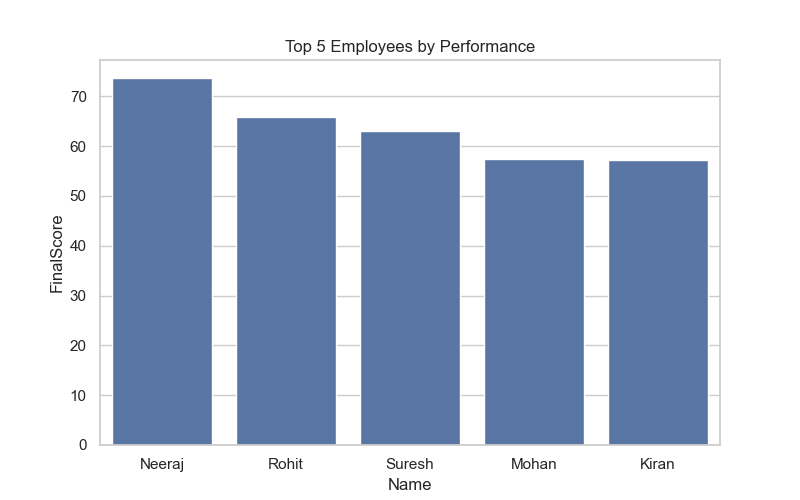

# Employee Performance Tracker 📊

This project analyzes employee performance using Python and Data Analysis techniques.

## 📌 Project Features
- Data Cleaning on real-world dirty employee data
- Handling missing and incorrect values
- Feature engineering for performance score
- Top 5 employee performance analysis
- Visualization using Matplotlib & Seaborn

## 🛠️ Technologies Used
- Python
- Pandas
- NumPy
- Matplotlib
- Seaborn

## 📂 Files in this Repository
- Employee_Performance.ipynb → Main analysis notebook
- employee_data_dirty.csv → Raw dataset
- employee_data_cleaned.csv → Cleaned dataset
- top_5_employees_performance.png → Visualization output

## 📊 Sample Visualization

## 🎯 Learning Outcomes
- Real-world data cleaning
- Data analysis workflow
- Performance evaluation
- GitHub project structuring

## ⚠️ Note
This project is created for learning and academic purposes.
